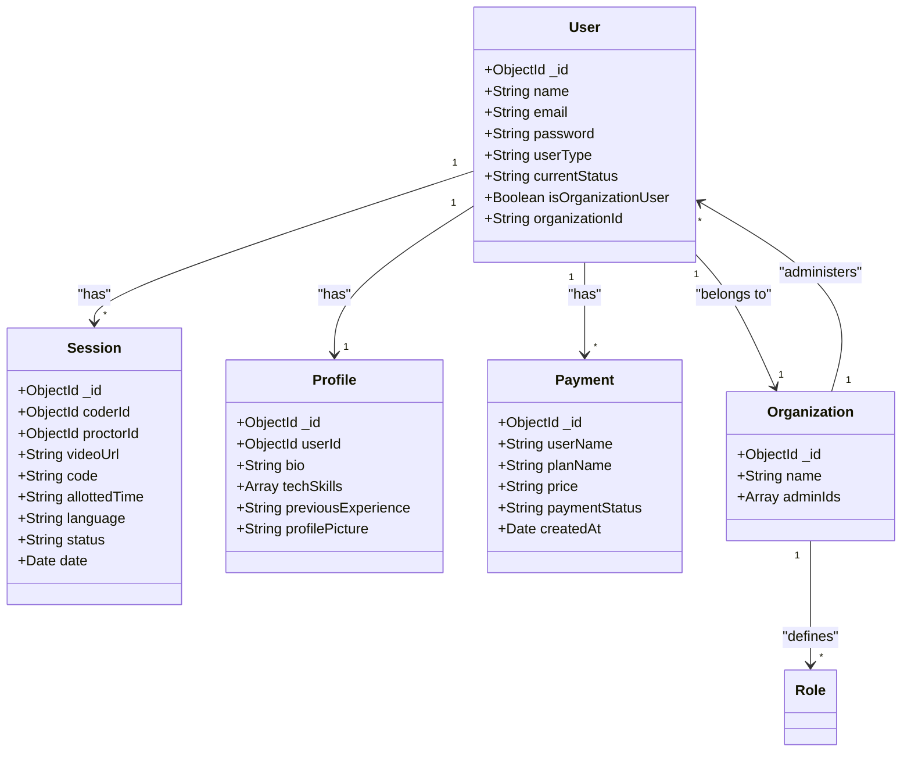

# CodeBuddies - A Pair Programming Platform

CodeBuddies is a collaborative platform designed to facilitate pair programming sessions. The application allows users to connect in real-time, with features for video/audio calls, a shared code editor, and session recording, making it ideal for remote development, mentoring, and onboarding processes.

## Features Overview

- **Video and Audio Call**  
  Users can establish a video/audio call, allowing each user to see and hear each other through their webcams and microphones.

- **Shared Code Editor**  
  The platform offers a collaborative code editor, where edits by one user are reflected instantly on the other’s screen, creating a real-time, synchronized coding experience.

- **Session Recording**  
  Sessions can be recorded (feature to be fully implemented) for later review, with the video and code changes saved for reference.

## Key Features

### User Authentication and RBAC

- **User Authentication:** Users can create and manage individual accounts.
- **Role-Based Access Control (RBAC):** Organizations can create business accounts, granting role-based access permissions for their employees.

### Real-Time Video Call

- **WebRTC-Powered Calls:** Users can connect via WebRTC for high-quality, real-time video and audio communication.
- **Multiple Video Streams:** Both local and remote video feeds are displayed during the session, offering a comprehensive visual setup.

### Collaborative Code Editor

- **Monaco Editor Integration:** The platform features Monaco Editor, enabling real-time collaborative editing.
- **Instant Changes:** All code changes made by one user are immediately visible to the other, creating a seamless co-editing environment.

### Session Management

- **Session Invitations:** Users can initiate sessions by sending invites. Once accepted, a session begins.
- **Session Termination:** When the session ends, both the video/audio feed and code editor are closed.
- **Recording and Saving:** The session recording feature will save the video and code state for future access.

### Subscription Plans

- **Payment Module:** Users can choose between a free standard plan or a premium subscription, unlocking additional features and benefits.

### Notifications

- **Real-Time Notifications:** Users receive alerts for session invitations, status changes, and updates, ensuring smooth communication.

### Profile Module

- **User Profile Management:** Users can view and update their profile details, including username, bio, and profile picture.
- **Progress Tracking:** Profiles include a track record of completed sessions, contributions, and feedback.
- **Privacy Settings:** Users can set their profile visibility and session invitation preferences.

### Dashboard

- **Activity Log:** Users can view a history of past sessions, including details of subscription status, saved code, duration, and recorded video.
- **Notifications**: Real-time notifications are displayed on the dashboard for invites, updates, and other activity.

## Tech Stack

### Frontend

- **React:** Provides the user interface for a responsive and interactive experience.
- **PeerJS:** Simplifies WebRTC-based video/audio calls, allowing seamless peer-to-peer connectivity.
- **Monaco Editor:** The collaborative code editor with real-time updates between users.

### Backend

- **Node.js and Express:** Provides server-side support and API management.
- **Socket.IO:** Manages real-time code synchronization, session status updates, and WebSocket communication for immediate feedback during collaboration.

### Team Members

- **Saloni Mathure** mathure.s@northeastern.edu
- **Sahil Satramani** satramani.s@northeastern.edu
- **Lavanya Rajesh** rajesh.l@northeastern.edu
- **Nehal Vaiti** vaiti.n@northeastern.edu

# Microsoft streams link :

https://northeastern-my.sharepoint.com/:v:/r/personal/satramani_s_northeastern_edu/Documents/Recordings/Call%20with%20Lavanya%20and%202%20others-20241207_224937-Meeting%20Recording.mp4?csf=1&web=1&e=9NeiMe&nav=eyJyZWZlcnJhbEluZm8iOnsicmVmZXJyYWxBcHAiOiJTdHJlYW1XZWJBcHAiLCJyZWZlcnJhbFZpZXciOiJTaGFyZURpYWxvZy1MaW5rIiwicmVmZXJyYWxBcHBQbGF0Zm9ybSI6IldlYiIsInJlZmVycmFsTW9kZSI6InZpZXcifX0%3D

# CodeBuddies Platform - Object Model Diagram

